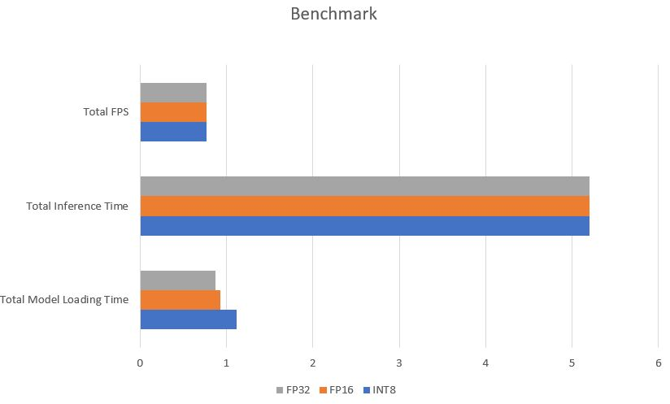

# Computer Pointer Controller

Computer Pointer Controller or Cursor Controller is Deep Learning Project made with the use of OpenVino Toolkit, in this project the users can move the cursor of the computer with the movement of their eyes, the video of user can be provided with webcam or a video file. OpenVino Toolkit with the Pre-Trained Deep Learning Models made this project easy to implement and deploy. The output of one model is passed as input in second model to make the application work as a single unit.

## Project Set Up and Installation
Follow the steps below to setup the environment for running the project on Windows 10:
1. Downloading OpenVino Toolkit from Intel’s [official site](https://software.intel.com/content/www/us/en/develop/tools/openvino-toolkit/choose-download/windows.html).
1. Download and install Cmake for Windows [from here](https://cmake.org/download/).
1. Download and install [Python 3.5 or Python 3.6](https://www.python.org/downloads/).
1. Download Visual Studio 2019 with Desktop Environment [from here](https://visualstudio.microsoft.com/downloads/).
1. After Installing all the above:
   1.Open CMD as administrator and type:
    
     `"C:\Program Files (x86)\IntelSWTools\openvino\bin\setupvars.bat"`
     
     Press Enter.
     
     If this message shows up that means OpenVINO is installed successfully on the system.
      
1. Download the models with Model Downloader:
 
   <b>Face Detection Model</b>
    
   <code>python "C:\Program Files (x86)\IntelSWTools\openvino\deployment_tools\tools\model_downloader\downloader.py" --name "face-detection-adas-binary-0001" -o %userprofile%/Desktop/</code>
    
    <b>Facial Landmarks Detection Model</b>
    
   <code>python "C:\Program Files (x86)\IntelSWTools\openvino\deployment_tools\tools\model_downloader\downloader.py" --name "landmarks-regression-retail-0009"" -o %userprofile%/Desktop/</code>
    
   <b>Head Pose Estimator Model</b>
    
   <code>python "C:\Program Files (x86)\IntelSWTools\openvino\deployment_tools\tools\model_downloader\downloader.py" --name "head-pose-estimation-adas-0001" -o %userprofile%/Desktop/</code>
    
   <b>Gaze Estimator Model</b>
    
   <code>python "C:\Program Files (x86)\IntelSWTools\openvino\deployment_tools\tools\model_downloader\downloader.py" --name "gaze-estimation-adas-0002" -o %userprofile%/Desktop/</code>

## Project Directory Structure

* Clone this repository and extract.
* The `bin` folder cotains.
  * `demo.mp4` file used to run demo application, user have choice to use the video file or camera feed.
* `requirements.txt` contains all of the required modules for running the application.
* The `src` folder contains:
  * face_detection.py, facial_landmarks_detection.py, gaze_estimation.py, head_pose_estimation.py, main.py, these python files are used to take the video and predict the various features from it.
  * input_feeder.py passes the input which can be webcam feed or the video file for the inference.
  * mouse_controller.py it uses the x,y coordinates to move the cursor of the users computer using pyautogui library.
## Pipeline

## Demo
**Steps to run the demo**
1. `Required: ` Clone this repository and extract.
1. Install the requirements: `pip install -r requirements.txt`.
1. Initialize OpenVINO: `"C:\Program Files (x86)\IntelSWTools\oepnvino\bin\setupvars.bat`.
1. Goto the src folder of project and open cmd in that folder.
1. Run the application:
<code>
   python main.py -f <”path of face detection model .xml file”> -fl <”path of face landmarks detection .xml file”> -hp <”path of head pose estimation model .xml file”> -g <”path of gaze estimation model .xml file”> -i <”path of video file / cam for webcam feed”> -d <”Specify device: CPU/GPU/VPU/FPGA “CPU is the default”> -v <”to visualize the results of particular model enter one or more than one key followed by space: fd fld hp ge“>  -b <”true / false for benchmark”> 
</code>

## Documentation
* `-f` argument takes the path of xml file of face detection model.
* `-fl` argument takes the path of xml file of facial landmarks detection model.
* `-hp` argument takes the path of xml file of head pose estimation model.
* `-g` argument takes the path of xml file of gaze estimation model.
* `-i` argument takes the path of video file or string “cam” for webcam feed.
* `-v` argument takes set of strings like fd fld hp ge, followed by space. To visualize the intermediate outputs of the models. Single or multiple strings can be passed at once.
* `-l` argument takes the cpu extension
* `-prob` argument takes the probability threshold for the model accuracy. It is 0.6 by default
* `-d` argument takes the type of device: CPU/GPU/VPU/FPGA. CPU is default
* `-b` argument takes string “true” or “false” to write the benchmarking values like inference time, model loading time and FPS in the file.

## Benchmarks
I ran this application on **Intel i5 7th gen CPU**.
 
**Table: Benchmark result of different Precisions**
Precision | Total Model Loading Time | Total Inference Time | Total FPS
----------| -------------------------| ---------------------| --------- 
INT8 | 1.114679337s | 5.2s | 0.769231 per/sec
FP16 | 0.934048414s | 5.2s | 0.769231 per/sec
FP32 | 0.875655651s | 5.2s | 0.769231 per/sec

**Graphical Representation**
 

## Results
* Precision affects the accuracy of the model and running speed. Inference speed becomes faster if we use low preicision becuase in less precision model there is less amount of computation involved. The accuracy gets affected because in the low precision the important features gets lost.
* There is the trade-off between the accuracy and inferece speed of precision: ***Low accuracy, fast inference and vice-versa***. 

## Stand Out Suggestions
**I created a pipline that can take both video file and webcam input to run inference.** 
 
To pass video file:
 
Pass this while running the application: `-i <path of video file>`
 
To pass webcam feed:
 
Pass this while running the application: `-i cam`

### Edge Cases
There will be some cases that can break and influence the inference flow to not work properly. For example, lighting conditions or multiple people in one single frame.
  *	**Lighting conditions:** It is one of the important feature because the primary source for inference is the video if the lightning condition is not good in the video the models would not be able to extract facial features and so the inference could not be performed.
  *	**Multiple persons in a single frame:** The project is made to control the movement of cursor using the eye moment of the person. If there are more than one person in the single frame. The model will get ambiguity error.

